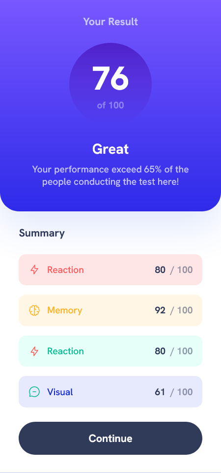

# Frontend Mentor - Results summary component solution

This is a solution to the [Results summary component challenge on Frontend Mentor](https://www.frontendmentor.io/challenges/results-summary-component-CE_K6s0maV). Frontend Mentor challenges help you improve your coding skills by building realistic projects.

## Welcome! 👋

I've completed the front-end mentor challenge and created the component to look as close as possible to the design provided, made it responsive to web and mobile devices, following best practices, and focused on minute details.

## Table of contents

- [Overview](#overview)
  - [The challenge](#the-challenge)
  - [Screenshot](#screenshot)
  - [Links](#links)
- [My process](#my-process)
  - [Built with](#built-with)
- [Author](#author)

## Overview

### The challenge

In order to get more comfortable with the fundamentals, I didn't use anything not included in the vanilla HTML and CSS. I used Vite.js for front-end tooling to use the power of npm whenever required and generated the build version of the project with minified HTML and CSS.

The component is simple, but it took more time than I expected to get it completed, and it also required extra efforts to understand the colors and shades with HSL values and gradients. However, I am satisfied with the end result and will continue to look over the code to make it more efficient as possible.

Thank you, [Frontend Mentor!](https://www.frontendmentor.io) I have really enjoyed the challenges and learnings throughout this course, and I am making a lot of progress toward becoming a better developer. I can't wait to complete many projects soon!

[Frontend Mentor](https://www.frontendmentor.io) challenges help you improve your coding skills by building realistic projects.

### Screenshot

#### Mobile View

#### Desktop View

### Links

- Solution URL: [https://github.com/saurav-verma-01/Frontend-Mentor-Results-summary-component](https://github.com/saurav-verma-01/Frontend-Mentor-Results-summary-component)

- Live Site URL: [https://saurav-fem-results-summary.netlify.app/](https://saurav-fem-results-summary.netlify.app/)

## My process

### Built with

- Semantic HTML5 markup
- CSS custom properties
- Flexbox
- Mobile-first workflow

## Author

- Frontend Mentor - [@Saurav-98](https://www.frontendmentor.io/profile/Saurav-98)
- Twitter - [@SauravKverma22](https://twitter.com/SauravKverma22)
- Github - [saurav-verma-01](https://github.com/saurav-verma-01)
- Linkedin- [/in/saurav-dev/](https://www.linkedin.com/in/saurav-dev/)
